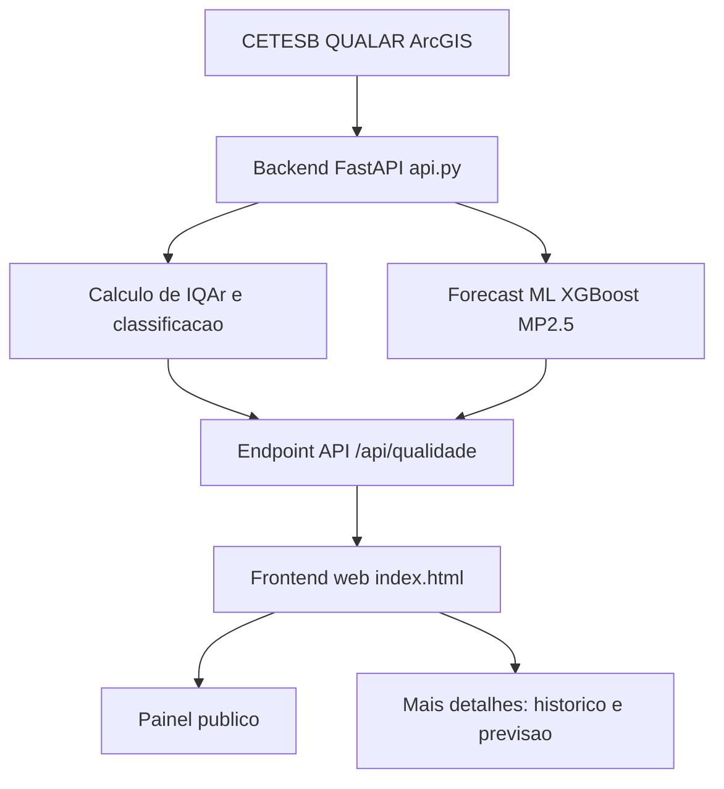
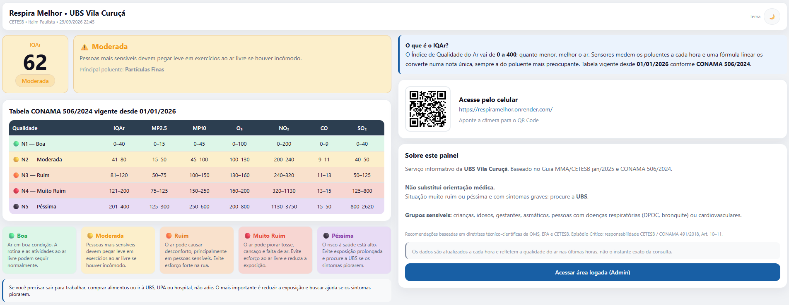
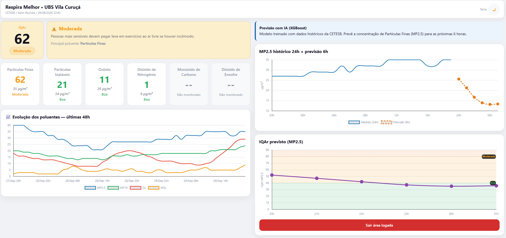
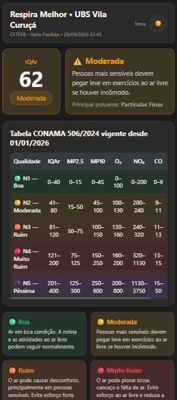
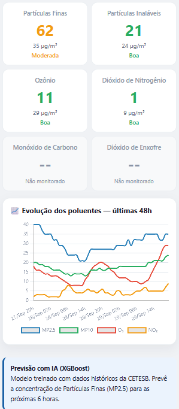

# Respira Melhor


Painel web de monitoramento da qualidade do ar com foco em saúde pública local, integrando dados oficiais da CETESB, cálculo de IQAr conforme CONAMA 506/2024 e previsão de curto prazo com Machine Learning.

Projeto desenvolvido para dar suporte informativo ao território da UBS Vila Curuça, com linguagem acessível para a população e camada técnica para análise detalhada.

## Contexto acadêmico

Este projeto é uma entrega de **Projeto Integrador (PI)** da **Univesp**. O desenvolvimento combina aplicação prática em tecnologia com impacto social local, conectando análise de dados ambientais, visualização e apoio à tomada de decisão em saúde.

Referência oficial sobre o Projeto Integrador da Univesp:

- https://apps.univesp.br/o-que-e-projeto-integrador/

### Valor acadêmico e de portfólio

- Problema real com impacto social: apoio informativo em saúde ambiental para território local.
- Integração ponta a ponta: coleta de dados oficiais, processamento, modelagem preditiva e visualização.
- Alinhamento com competências do PI: aplicação interdisciplinar, entrega funcional e evidência técnica.
- Material pronto para banca e GitHub: documentação, arquitetura, API, prints e roadmap.

## Visão geral

O sistema coleta dados horários de poluentes atmosféricos da estação Itaim Paulista (CETESB), calcula o índice de qualidade do ar por poluente, determina o IQAr geral (pior caso) e apresenta recomendações de cuidado em saúde.

Além da visão principal para público geral, o projeto possui a área **Mais detalhes**, com gráficos históricos e recursos preditivos baseados em IA.

## Principais funcionalidades implementadas

- Coleta automática de dados de qualidade do ar via serviço ArcGIS da CETESB (QUALAR).
- Cálculo de IQAr por poluente (MP2.5, MP10, O3, NO2, CO, SO2) com interpolação linear por faixas oficiais.
- Classificação do IQAr em 5 níveis: Boa, Moderada, Ruim, Muito Ruim e Péssima.
- Identificação do poluente crítico da hora e geração de recomendação textual orientada à saúde.
- Painel responsivo com tema claro/escuro.
- Acesso direto à área de análise detalhada (Mais detalhes).
- Cache no backend (TTL de 10 minutos) para reduzir carga externa e melhorar disponibilidade.
- Cache local no frontend (15 minutos) para resiliência quando houver indisponibilidade temporária da API.
- Área **Mais detalhes** com gráficos de histórico e previsão.

## Destaque: dados preditivos com ML

O backend já entrega previsão de curto prazo com modelo **XGBoost** para MP2.5.

- Modelo carregado em memória no startup da API (`modelo_xgboost.pkl`).
- Features versionadas (`features.pkl`) para manter consistência entre treino e inferência.
- Engenharia de atributos com:
  - componentes temporais cíclicos (`hora_sin`, `hora_cos`);
  - dia da semana;
  - lags de MP2.5 (1h, 2h, 3h, 6h, 12h, 24h);
  - lags cruzados de MP10, O3 e NO2;
  - médias móveis (3h e 6h);
  - variação recente (`diff_1h`).
- Geração iterativa de previsão para as próximas **6 horas**.
- Conversão da concentração prevista de MP2.5 em IQAr previsto, permitindo visualização de risco por faixa.

## Destaque: gráficos da área "Mais detalhes"

Na seção **Mais detalhes**, já estão implementados 3 blocos gráficos:

1. **Evolução dos poluentes (48h)**
   - Série temporal comparativa de MP2.5, MP10, O3 e NO2.

2. **MP2.5 histórico 24h + previsão 6h**
   - Continuidade visual entre dados medidos e projeção do modelo XGBoost.

3. **IQAr previsto (MP2.5)**
   - Curva de IQAr futuro com faixas de risco e linhas de referência (Boa, Moderada, Ruim).

Esses gráficos já consomem diretamente o payload estruturado da API em `graficos.historico_48h` e `graficos.previsao_mp25`.

## Arquitetura da solução



## Stack técnica

### Backend

- FastAPI
- Uvicorn
- Pandas / NumPy
- Requests
- Cachetools
- Scikit-learn / Joblib / XGBoost

### Frontend

- HTML, CSS e JavaScript (vanilla)
- Chart.js + plugin de annotation
- Toastify

## Estrutura do repositório

```text
assets/
backend/
  api.py
  modelo_xgboost.pkl
  features.pkl
  requirements.txt
frontend/
  index.html
```

## API

### Endpoint principal

- `GET /api/qualidade`

Retorna:

- metadados de coleta;
- IQAr geral, classificação, poluente crítico e recomendação;
- lista de poluentes com valor e status;
- blocos prontos para gráficos históricos e preditivos.

Exemplo simplificado de resposta:

```json
{
  "data_coleta": "29/09/2026 10:00",
  "iqa_geral": 72,
  "classificacao": "Moderada",
  "poluente_critico": "Partículas Finas",
  "recomendacao_padrao": "Pessoas mais sensíveis devem pegar leve...",
  "poluentes": [
    { "nome": "Partículas Finas", "iqa": 72, "valor": 32.1, "unidade": "µg/m³", "status": "Moderada", "cor_hex": "#F39C12" }
  ],
  "graficos": {
    "historico_48h": {
      "labels": ["28/Sep 11h", "28/Sep 12h"],
      "mp25": [25.4, 28.1],
      "mp10": [48.2, 50.0],
      "o3": [60.5, 58.0],
      "no2": [72.0, 70.3]
    },
    "previsao_mp25": {
      "hist24_labels": ["11h", "12h"],
      "hist24_vals": [25.4, 28.1],
      "fc_labels": ["13h", "14h", "15h", "16h", "17h", "18h"],
      "fc_conc": [30.0, 31.2, 33.1, 34.0, 32.8, 31.7],
      "fc_iqa": [74.5, 76.1, 79.0, 81.4, 78.8, 76.9]
    }
  }
}
```

### Health check

- `GET /`
- `HEAD /`

## Como executar localmente

### 1) Backend

```bash
cd backend
python -m venv .venv
# Windows PowerShell
.\.venv\Scripts\Activate.ps1
pip install -r requirements.txt
uvicorn api:app --reload --host 0.0.0.0 --port 8000
```

API local: `http://localhost:8000`

### 2) Frontend

Abra `frontend/index.html` no navegador.

Observação: atualmente o frontend está apontando para a API publicada em produção (`respiramelhor-api.onrender.com`). Para usar 100% local, ajuste a constante `API_URL` no JavaScript para `http://localhost:8000/api/qualidade`.

## Evidências visuais

### Desktop




### Mobile




## Roadmap imediato

- Expandir previsões para múltiplos poluentes além de MP2.5.
- Adicionar versionamento formal de modelo e métricas de desempenho no repositório.

## Aviso importante

Este painel é informativo e não substitui avaliação clínica. Em caso de sintomas respiratórios importantes (falta de ar, dor no peito, piora súbita), procurar UBS/UPA/hospital.
